# Healthcare Provider Finder App

A full-stack mobile app that helps users locate nearby healthcare providers based on their symptoms or conditions and ZIP code. Built using **React Native (via Snack)** and **Node.js/Express (via Replit)**, this app uses the CMS NPI Registry API and Google Maps to deliver fast, accurate, and location-specific provider results.

---

## 🔗 Live Demo

- 📱 Frontend (Snack): [Healthcare Recommendation App on Snack](https://snack.expo.dev/@poojitha_dontineni/healthcare-recommendation-app-_-no-camera?platform=web)
- 🖥️ Backend (Replit): [Server.js on Replit](https://replit.com/@stonebrookashle/Serverjs#index.js)

---

## Features

- 🔎 Smart search for providers by condition + ZIP
- 🧠 Auto-maps user symptoms to 30+ specialties
- 🗺️ Google Maps integration for viewing addresses
- 🧱 Backend logic with NPI Registry API
- 🔐 Built-in rate limiting for API protection
- 📱 Clean React Native UI

---

## How to Use the App

Let's say you have **knee pain** and live in ZIP code **10001**:

1. Open the app.
2. Type “knee pain”.
3. Enter “10001”.
4. Tap **Search Providers**.
5. You'll see nearby **physical therapists** or relevant specialists.

---

## Tech Stack

| Layer        | Technology                 |
|--------------|----------------------------|
| Frontend     | React Native (Expo Snack)  |
| Backend      | Node.js, Express.js        |
| APIs         | NPI Registry, Google Maps  |
| Security     | express-rate-limit, CORS   |

---

## Condition-to-Specialty Mapping

Examples of smart backend condition mapping:

| User Input       | Mapped Specialty       |
|------------------|------------------------|
| back pain        | Chiropractor           |
| migraine         | Neurology              |
| depression       | Psychiatry             |
| joint pain       | Orthopedic Surgery     |
| rash             | Dermatology            |

_(See full logic in `backend/index.js`, `mapConditionToTaxonomy()` function)_

---

## 🔄 What Happens Behind the Scenes (HTTP Flow)

### Step 1: You Tap “Search Providers”

The frontend sends an **HTTP POST** request to the backend:
POST/providers

It includes your condition and ZIP code in the body:
```json
{
  "condition": "knee pain",
  "zip": "10001"
}
```
### Step 2: The Server (Backend) Gets to Work
Backend processes condition and fetches providers:

1. 🧠 Maps your condition (like `"knee pain"`) to a specialty (like `"Physical Therapist"`).

2. 🌐 Contacts the NPI Registry API, a government database of U.S. healthcare providers and queries the CMS NPI Registry API:

```perl
https://npiregistry.cms.hhs.gov/api/?version=2.1&postal_code=10001&taxonomy_description=Physical%20Therapist
```
3. 🔁 If no providers are found, it retries using "Family Medicine" as a fallback.

4. 📦 Otherwise, it returns up to 5 formatted results (name, address (in the form of a Google Maps link), and specialty)

### Step 3: The App Displays Results
The frontend receives the response and shows it to you like:
```json
[
  {
    "name": "Dr. Jane Smith",
    "specialty": "Physical Therapist",
    "displayAddress": "123 Main St, New York, NY 10001",
    "address": "https://www.google.com/maps/search/?api=1&query=123+Main+St,+New+York,+NY+10001"
  }
]
```

---

## Full App Data Flow Diagram:

```mermaid
flowchart LR
    A["📱 Mobile App
            (React Native)"] -->|POST/providers| B["🌐 Backend
                                                        (Express.js)"]
    B -->|List of Providers| A
    B --> C["NPI Registry API
             (U.S. Gov Database)"]
    C --> D["Returns raw provider data"]
```



## Backend Logic Flow Diagram:

```mermaid
flowchart TD
    A["User Input
       ('back pain', ZIP)"] --> B["mapConditionToTaxonomy()"]
    B --> C["Mapped to: 'Chiropractor'"]
    C --> D["Query NPI Registry API with ZIP and specialty"]
    D --> E{"Any providers found?"}
    E -- Yes --> F["Return 0–5 Providers"]
    E -- No --> G["Try fallback: 'Family Medicine'"]
    G --> H["Query NPI Registry API with ZIP and Family Medicine"]
    H --> I["Return 0–5 Providers"]
```



---

## Rate Limiting:
To prevent overload or abuse:
- Users are limited to 30 searches per hour (based on IP address).
- If exceeded, you’ll see:
```json
{ "error": "Rate limit exceeded. Please try again in an hour." }
```

---

## Running the App

Since this was built on cloud platforms:

### ▶ Frontend
- Open the Snack link above to test and edit the React Native app in-browser.
> ⚠️ **Make sure the backend server is running first before testing the app in Snack.**  
> The frontend relies on real-time API responses from the backend to display provider results.

### ▶ Backend
- Visit the Replit link to run or inspect the backend server.
